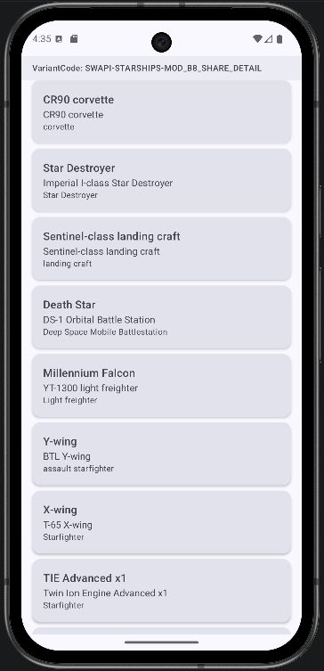
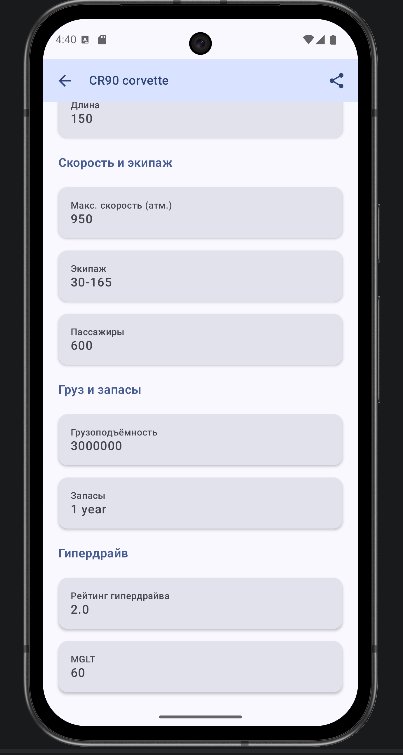

# Starships Catalog

**VariantCode: SWAPI-STARSHIPS-MOD_B8_SHARE_DETAIL**

Приложение для просмотра списка звёздных кораблей (Starships) из [SWAPI](https://swapi.dev/) и детальной информации по каждому кораблю. В лаунчере отображается как **Starships Catalog**.

---

## 1. Вариант и модификатор

Формат варианта: **SWAPI** — **STARSHIPS** — **MOD_B8_SHARE_DETAIL**.
Выполнила: Сидоренко Мария Александровна Б9123-09.03.03ПИКД

| Часть | Значение | Описание |
|-------|----------|----------|
| **SWAPI** | Star Wars API | Публичное API по вселенной Star Wars. Base URL: `https://swapi.dev/api/` |
| **STARSHIPS** | Ресурс «Корабли» | Раздел `/starships/`: список и детали звёздных кораблей |
| **MOD_B8_SHARE_DETAIL** | Модификатор B8 | **Share из Detail** — с экрана деталей корабля можно поделиться информацией через **стандартный системный Share Intent** (кнопка «Поделиться» в AppBar). |

В UI приложения (на экране списка) отображается строка **VariantCode: SWAPI-STARSHIPS-MOD_B8_SHARE_DETAIL** в соответствии с ТЗ.

---

## 2. Базовые требования

| Требование | Реализация |
|------------|------------|
| **Стек** | Kotlin, Jetpack Compose, Coroutines. Сеть: **Retrofit + OkHttp** (Gson). |
| **Архитектура** | Слой **data** (DTO, API, Repository impl, Mapper) → слой **domain** (модели Starship / StarshipDetail, интерфейс Repository) → **ViewModel** → **UI** (Compose). DTO в UI не используются, только domain-модели. |
| **Экран List** | Список кораблей по ресурсу Starships, **первая страница** (`/starships/?page=1`). |
| **Экран Detail** | Открывается по клику из списка, детали грузятся **отдельным запросом по id** (`/starships/{id}/`). |
| **Состояния** | **Loading** / **Content** / **Error**. При ошибке — понятный текст и кнопка **Retry**. |
| **DI** | **Hilt** (модуль `AppModule`, `@HiltViewModel`, внедрение Repository и API). |

---

## 3. API (SWAPI — Starships)

**Base URL:** `https://swapi.dev/api/`

| Назначение | Метод | Endpoint |
|------------|--------|----------|
| Список (первая страница) | GET | `/starships/?page=1` |
| Детали по id | GET | `/starships/{id}/` |
| Поиск (опционально) | GET | `/starships/?search=<q>` |

В проекте используются два вызова: список кораблей (page=1) и детали по выбранному `id`.

---

## 4. Модификатор MOD_B8_SHARE_DETAIL

- На экране **Detail** в AppBar есть кнопка **«Поделиться»**.
- По нажатию вызывается системный **Share Intent** (`Intent.ACTION_SEND`, `text/plain`).
- В текст шаринга входят: ссылка на `https://swapi.dev/api/starships/{id}/`, название корабля, модель, производитель, класс.
- Выбор приложения для отправки — через **Intent.createChooser**.

---

## 5. Скриншоты

| Экран списка | Экран деталей |
|--------------|----------------|
|  |  |

